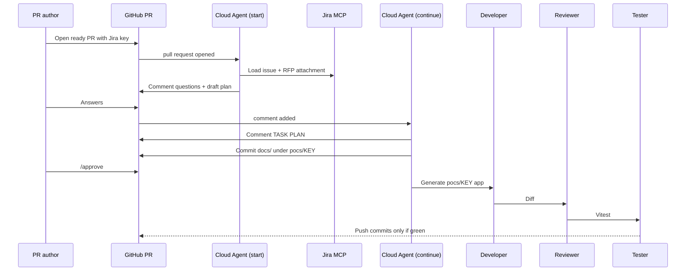

# IRFP POC Creator

## Goal

When someone opens a **ready-for-review GitHub Pull Request** in this repo that names a **Jira issue key**, a **Cursor Cloud Agent** fetches the **RFP file attached to that issue**, resolves gaps with the **PR author** in **PR comments**, generates a POC under `pocs/<JIRA-KEY>/`, runs **Vitest**, and **pushes onto that same PR**.

The agent must not invent business rules, must not ignore UI specs in the RFP, and must not push code when tests fail.

## What this repo is

This repository is both:

1. The **orchestrator** — agent instructions, skills, subagents, Cursor automations, and hooks.
2. The **POC drop zone** — generated apps live under `pocs/<JIRA-KEY>/` on the triggering PR. Orchestrator files at the repo root stay untouched.

Each run produces one demo-quality POC from one RFP. It is not a production system.

## Implementation map

| Piece | Location |
| --- | --- |
| Operating rules | `AGENTS.md`, `.cursor/rules/irfp.mdc` |
| Orchestrator + skills | `.cursor/skills/` |
| Slash commands | `.cursor/commands/` — catalog `docs/commands.md` |
| Subagents | `.cursor/agents/` (`rfp-analyst`, `requirements-planner`, `developer`, `reviewer`, `tester`) |
| Fail-closed hooks | `.cursor/hooks.json`, `.cursor/hooks/` |
| Run CLI | `node scripts/irfp.mjs` (`help`, `scaffold-poc`, `verify-structure`, …) |
| Doc templates | `templates/poc-docs/` |
| Next.js + Vitest + Tailwind scaffold | `templates/poc-next/` (copied by `scaffold-poc`; includes `components/ui`) |
| Cloud Agent prompts | `automations/start.md`, `automations/continue.md` |
| Operator setup | `docs/setup.md` |
| POC drop zone | `pocs/<JIRA-KEY>/` |

Connect Jira MCP, then create the two Cloud Agent automations (`docs/setup.md` and `automations/README.md`). Do not trigger on push.

## Locked decisions

| Topic | Decision |
| --- | --- |
| Git host | GitHub Pull Request |
| Which PRs start a run | Ready for review only. **Draft PRs are ignored.** |
| Jira key | First `PROJECT-123` pattern in the **PR title**, else the **PR body** |
| RFP source | File attached to that Jira issue |
| How a run starts | Cursor Cloud Agent on the PR |
| Ambiguity + task approval | Comments on the PR |
| Who may answer / approve | **PR author only** |
| Where code goes | Commits on the existing PR, in `pocs/<JIRA-KEY>/` |
| Default stack | Next.js App Router + TypeScript, demo UI, static/in-memory fake data |
| If the RFP names another framework | **RFP wins.** Rule 5 (Next.js) applies only when the RFP is silent |
| POC depth | Demo-quality UI with minimal fake data; server code only when the approved plan requires it (unless the RFP named another framework) |
| Unit tests | **Vitest.** Must pass before push |
| External links | No clickable `http(s)` links in the UI or markdown. Local assets and npm packages are allowed |
| Approval commands | PR author uses `/approve` or `/revise` in PR comments, or `/irfp-approve` / `/irfp-feedback` in Cursor |
| Planning artifacts | **Canonical copies live in `pocs/<JIRA-KEY>/docs/`** (not PR-only). PR comments are for Q&A and gates. |

## Trigger contract

A start run is valid only when all of the following are true:

1. A GitHub PR against this repository is opened **and is not a draft**.
2. A Jira issue key is present: scan the **title first**, then the **body**; use the first match of `[A-Z][A-Z0-9]+-[0-9]+`.
3. That Jira issue has at least one RFP file attached.
4. The **Start** Cloud Agent runs.

If any of those fail, the agent comments on the PR with what is missing and **stops**. It does not generate code.

### Two Cloud Agent moments (keep them separate)

Mixing these events causes loops: the agent’s own push would restart analysis.

| Moment | GitHub event | What the agent may do | What it must not do |
| --- | --- | --- | --- |
| **Start** | Pull request opened (ignore drafts) | Read PR, extract Jira key, fetch RFP attachment via Jira MCP, analyze, post questions and a draft task plan as PR comments | Generate app code, push commits |
| **Continue** | Comment added on the PR | If the comment is from the **PR author**: record answers, revise the plan, or start generation after approval | Treat the agent’s own comments as approval. Ignore everyone who is not the PR author |

**Loop guard:** a push from the agent must not start a new analysis. Code generation runs only after the PR author approves the task list in a comment.

## End-to-end flow

```text
Ready PR opened (Jira key in title or body)
  → Cloud Agent (start) — drafts ignored
  → Parse first Jira key (title, then body)
  → Hook: RFP attachment exists?
  → Fetch attachment via Jira MCP
  → RFP Analyst: brief + gaps → write docs/rfp-brief.md
  → Requirements Planner: questions as PR comments
  → PR author replies on the PR → update docs/ambiguity-log.md
  → Planner posts the task list → write docs/technical-plan.md + docs/task-plan.md
  → PR author comments /approve
  → Developer: app in pocs/<JIRA-KEY>/
       stack = RFP framework if named, else Next.js demo UI + fake data
  → Reviewer: diff vs RFP + hard rules
  → Tester: Vitest
  → Hook: tests pass?
  → Push commits onto the same PR (never force-push)
```



## Actors

| Actor | Role |
| --- | --- |
| PR author | Opens the ready PR. Answers questions. Approves the task list. Only this person can approve. |
| Cloud Agent (orchestrator) | Routes steps, enforces gates, comments on the PR, pushes only after Vitest passes. |
| RFP Analyst | Reads the RFP attachment. Extracts capabilities, UI requirements (explicit vs derived), UI direction, and gaps. |
| Requirements Planner | Turns the brief into questions, a technical plan, and a task list. Owns the approval gate. |
| Developer | Implements only the approved tasks under `pocs/<JIRA-KEY>/`. |
| Reviewer | Checks the generated code against the RFP, brief UI requirements/direction, approved tasks, and hard rules. Independent of the Developer. |
| Tester | Writes and runs Vitest. Blocks push on failure. |

## Hard rules (stop conditions)

1. **UI specs win.** If the RFP includes layout, components, copy, or interaction notes, generated UI must match them. Do not “improve” or swap in a design system the RFP did not specify. If the RFP is silent on visuals, apply the **UI direction** in `docs/rfp-brief.md` as theme only — do not invent extra screens or business rules.
2. **No secrets in code.** No API keys, tokens, passwords, or connection strings in source, comments, logs, or PR text. Env placeholders only. Never commit a `.env` file that contains values.
3. **No invented business rules.** If a rule is missing, conflicting, or vague, comment on the PR and wait. Do not guess and proceed.
4. **No sensitive data in the POC.** Do not copy real customer records, credentials, or confidential annexes into fixtures or sample payloads. Use clearly fake data.
5. **Framework.** If the RFP names a framework, use it. If the RFP is silent, use Next.js (App Router + TypeScript). The PR author may still override in a comment. Do not switch stacks silently when the RFP is silent.
6. **Tests are a gate.** Vitest must pass. If tests fail, do not push. Fix or stop and comment the failures on the PR.
7. **No clickable external links.** The POC UI and markdown must not contain `http://` or `https://` hrefs (or equivalent clickable URLs). Local assets, in-app routes, and npm packages are allowed. Do not load fonts, images, or scripts from a CDN URL in the generated UI. `next/font/google` and remote `` are forbidden; use local files.
8. **Write path only.** All generated code, tests, and POC docs live under `pocs/<JIRA-KEY>/`. Do not modify orchestrator files at the repo root (`.cursor/`, `Readme.md`, hooks, automations). If a change is needed outside that folder, comment on the PR and stop.
9. **One POC per Jira key.** Use the resolved issue key as the folder name (`pocs/PROJ-123/`). Do not reuse, rename, or split across sibling folders in the same PR run.
10. **Approved tasks only.** Implement exactly what the PR author approved in the task list—no extra screens, APIs, or libraries. Visual quality of those screens (theme from UI direction, responsive layout, loading/empty/error states) is required, not optional polish. **POC visual standard:** approved screens must look **modern** and **demo-impressive within restraint** (domain-specific tokens, first-viewport focal point, obvious primary CTA). No extra features. Typographic covers unless the RFP supplies real image files. If new **functional** work is needed, post a revised `TASK PLAN` and wait; do not ship scope creep.
11. **No force-push.** Push commits onto the existing PR branch only. Never force-push, never open a second PR, never rewrite unrelated PR title/body/commits.
12. **Minimal dependencies.** Add npm packages only when required by an approved task or a named RFP constraint. Do not pull in UI kits, ORMs, or SDKs the RFP did not ask for.
13. **No dangerous patterns.** No `eval`, `new Function`, or unsanitized `dangerouslySetInnerHTML` with user- or RFP-sourced strings. Treat fixture and form input as untrusted at API boundaries.
14. **No large binaries.** Do not commit `node_modules`, build output, or multi‑MB assets. RFP-required attachments belong outside git or as clearly documented placeholders—not bloated blobs in the POC tree.
15. **License-safe dependencies.** Only use npm packages with permissive OSS licenses suitable for a client demo. No GPL or other copyleft deps unless the RFP or PR author explicitly allows them.

## Pipeline (gated)

Each step has a required input, an owner, an output, and a gate. A failed gate stops the run and comments on the PR.

| # | Step | Owner | Input | Output | Gate |
| --- | --- | --- | --- | --- | --- |
| 0 | Pre-check | Hook + Start agent | GitHub PR | First Jira key from title then body; issue reachable | Draft PR → do not start. Missing key → stop and comment. |
| 1 | Fetch RFP | Orchestrator + Jira MCP | Jira issue | RFP attachment bytes + story fields | **Hook: RFP attachment exists before analyst.** Zero attachments → stop. Multiple attachments → ask the PR author which file(s) to use. |
| 2 | Analyze RFP | RFP Analyst | RFP file(s) | `docs/rfp-brief.md` + PR summary comment | Brief covers description, capabilities, UI requirements (explicit vs derived), and UI direction. Blocking gaps are business rules/conflicts only — missing branding is filled as inferred direction. File committed under `pocs/<JIRA-KEY>/docs/`. |
| 3 | Resolve ambiguities | Requirements Planner | Brief | Numbered questions on the PR + `docs/ambiguity-log.md` | Every blocking gap has a reply from the **PR author**. Log updated after each author reply. No silent defaults for business rules. |
| 4 | Plan technical requirements | Requirements Planner | Brief + answers | `docs/technical-plan.md` + PR summary comment | Stack (RFP or Next.js), screens, routes, local data, Vitest checks. Still no app code. |
| 5 | Generate tasks | Requirements Planner | Technical plan | `docs/task-plan.md` + PR `TASK PLAN` comment | **PR author must comment `/approve`.** No generation until then. On `/revise`, update the files and wait again. |
| 6 | Generate code | Developer | Approved tasks + brief UI requirements/direction | App under `pocs/<JIRA-KEY>/` | Tasks map 1:1 to changes. No extra features. Theme follows UI direction when explicit design is absent. Persistence is local/fake unless the RFP named a real backend **and** it can run without secrets in git. Do not edit orchestrator files outside `pocs/<JIRA-KEY>/`. |
| 7 | Code review | Reviewer | Diff + RFP + rules | `docs/review-report.md` + PR summary comment | Fail the run on any hard-rule violation (UI drift, secrets, clickable external URLs, scope creep, dangerous patterns, bad deps/licenses, large binaries, writes outside `pocs/<JIRA-KEY>/`, and so on). Return to Developer or Planner. |
| 8 | Generate unit tests | Tester | Code + task checks | Vitest files in the POC | Tests cover the approved checks, not a generic template. |
| 9 | Execute unit tests | Tester + Hook | `vitest` in the POC directory | `docs/test-report.md` + PR summary comment | **Hook: tests must pass before submit.** Fail → no push; comment the output. |
| 10 | Push to PR | Orchestrator | Passing tree | Commits on the existing PR | Push the full `pocs/<JIRA-KEY>/` tree (app + `docs/`). Do not rewrite unrelated PR content. Never force-push. |

### Approval contract

- Ambiguity answers happen **before** the task list is finalized.
- Task-list approval happens **before** any POC app code is written.
- The agent posting “looks reasonable” is not approval.
- Only a comment from the **PR author** counts.
- Task-list approval is **`/approve`** only. **`/revise`** sends the Planner back to update `docs/task-plan.md` (and related docs) without generating code.
- PR comments announce changes; **`pocs/<JIRA-KEY>/docs/` is the source of truth** for brief, plan, and logs.
- If a new ambiguity appears during coding, the Developer **stops and comments**. It does not decide locally.

## Skills and subagents

Skills are capabilities. Subagents own a stage. One subagent must not skip another’s gate.

| Skill | Used by | Does | Does not |
| --- | --- | --- | --- |
| Analyze RFP | RFP Analyst | Extract capabilities, UI requirements, UI direction, framework, constraints, blocking gaps; write `docs/rfp-brief.md` | Invent missing business rules; skip UI direction |
| Generate tasks | Requirements Planner | Produce ordered, checkable tasks; copy UI direction into `docs/technical-plan.md`; write `docs/task-plan.md`; post `TASK PLAN` on the PR | Start coding; re-infer a different visual tone |
| Frontend development | Developer | UI from approved tasks + brief UI requirements/direction | Restyle away from explicit specs; re-analyze the RFP; add screens for polish |
| Backend development | Developer | Server/local persistence the approved plan named | Add APIs the RFP did not need; call real internet services; put secrets in git |
| Code review | Reviewer | Diff vs RFP, rules, approved tasks, folder boundary | Approve the original task list |
| Unit test | Tester | Generate and run Vitest for the checks | Push on red tests |

### Subagent boundaries

Defined as Cursor project subagents in `.cursor/agents/`. The orchestrator launches them with Task; it does not do their jobs itself.

1. **RFP Analyst** (`rfp-analyst`) — read-only on the RFP. Output is a brief + gap list.
2. **Requirements Planner** (`requirements-planner`) — owns questions, technical plan, task list, and the approval gate.
3. **Developer** (`developer`) — implements only approved tasks under `pocs/<JIRA-KEY>/`. New gaps → comment and wait.
4. **Reviewer** (`reviewer`) — independent of the Developer. Can reject back to Developer or Planner. Cannot approve the original task list.
5. **Tester** (`tester`) — owns Vitest generation and execution. Cannot override a review failure.

## Runtime wiring

### Cursor Cloud Agent (GitHub)

Needed tools on the automations:

- Comment on PRs
- Jira MCP (fetch issue + download attachment)
- Git checkout of this repo’s PR branch (Cloud Agent default)

Automations:

1. **IRFP — Start on PR open**
   - Event: pull request opened
   - Ignore draft PRs
   - Prompt: extract Jira key (title then body) → fetch attachment → analyze → comment questions/plan
   - Do not write app code
2. **IRFP — Continue on PR comment**
   - Event: comment added
   - Prompt: ignore non-authors and the agent’s own comments; apply answers; update `pocs/<JIRA-KEY>/docs/`; on `/approve`, generate → review → Vitest → push

Do **not** attach a “code pushed to PR” trigger to the Start flow.

### Cursor slash commands (local / chat)

Same gates as Cloud Agent Continue. Type `/` in Cursor chat. Catalog: `docs/commands.md`.

The human who runs the command is the operator. Docs under `pocs/<KEY>/docs/` stay canonical.

### Cursor project hooks

| Hook intent | Event | Behaviour |
| --- | --- | --- |
| RFP exists before analyst | `subagentStart` | Deny if no `mark-rfp-fetched` stamp |
| TASK PLAN approved before Developer | Skills + `mark-approved` | Required before generate. Hook script exists but is **unregistered** in `hooks.json` for now. |
| Unit tests pass before submit | `beforeShellExecution` on `git commit` / `git push` | Deny unless Vitest passed; docs-only commits allowed |
| Protect orchestrator files | `preToolUse` / `afterFileEdit` | Deny writes outside `pocs/<JIRA-KEY>/` after generate phase |
| No external URLs in POC | `preToolUse` / `afterFileEdit` | Deny `http(s)` and `next/font/google` in POC UI/markdown |
| No secrets in POC | `preToolUse` / `afterFileEdit` / `beforeShellExecution` | Deny secret patterns; do not echo matches |

Named gates fail **closed** (missing proof = block). One-page notes: `docs/hooks/`. Branch test: `node scripts/hooks-selftest.mjs`.

### Jira MCP

Who, allowlist, errors, golden-path checklist: `docs/mcp.md`.

Must be able to:

- Resolve the issue from the key on the PR
- List attachments
- Download the chosen RFP file

If the attachment is not plain text (PDF, DOCX, and so on), the analyst still extracts description, capabilities, UI requirements, and UI direction. If it cannot read the file, it comments and stops.

## POC technical defaults

Apply when the RFP is silent. If the RFP names a different framework or UI kit, follow the RFP. All agents follow `AGENTS.md`.

- Next.js App Router + TypeScript at `pocs/<JIRA-KEY>/`.
- Demo UI wired to static or in-memory fake data by default.
- Route Handlers or Server Actions only when the approved plan requires server round-trips.
- Persistence: fixtures and in-memory state first; local JSON only if refresh must keep data; SQLite only if the RFP required it. Not a hosted database.
- No auth vendor unless the approved plan names one **and** it can run with fake/local users.
- UI follows the RFP spec; no extra component library unless the RFP or the PR author names one.
- Package installs via npm/pnpm are allowed. Runtime fetch of `https://` URLs in the UI is not.
- Fonts and images: files in the POC folder only. Product/cover photos: use typographic cover tiles (`TypographicCover`) unless the RFP supplies real image files — no decorative placeholder art (see `frontend-development` skill).
- Secrets: `.env.example` with empty placeholders only. No real `.env` values.
- Tests: Vitest, run from the POC directory before push.

## Repo layout

```text
/                                    orchestrator (Readme, agent config, hooks, automations)
/.cursor/                            project hooks, skills, agents, slash commands
/.cursor/commands/                   see `docs/commands.md`
/pocs/PROJ-123/                      generated app for that Jira key
/pocs/PROJ-123/docs/rfp-brief.md     extracted capabilities, UI requirements, UI direction, framework, non-goals
/pocs/PROJ-123/docs/ambiguity-log.md questions + PR-author answers (updated as replies arrive)
/pocs/PROJ-123/docs/technical-plan.md stack, screens, routes, local data, Vitest checks
/pocs/PROJ-123/docs/task-plan.md     ordered task list (must match approved `/approve` comment)
/pocs/PROJ-123/docs/review-report.md pass/fail vs hard rules
/pocs/PROJ-123/docs/test-report.md   Vitest command, counts, failures
/pocs/PROJ-123/…                     app source + Vitest files
```

The Developer writes only under `pocs/<JIRA-KEY>/`. Merging a PR may leave that folder on `main`. A later PR for another key uses a sibling folder.

## Artifacts each run must leave

**Canonical location:** every artifact below is a committed file under `pocs/<JIRA-KEY>/docs/`. PR comments are summaries and gates only—they do not replace these files.

| File | Owner step | Contents |
| --- | --- | --- |
| `docs/rfp-brief.md` | Analyze RFP | Capabilities, UI requirements, UI direction, chosen framework, explicit non-goals |
| `docs/ambiguity-log.md` | Resolve ambiguities | Questions, PR-author answers, timestamps |
| `docs/technical-plan.md` | Plan technical requirements | Stack, screens, local data, APIs |
| `docs/task-plan.md` | Generate tasks | Ordered task list + checks (must match the `/approve` comment) |
| `docs/review-report.md` | Code review | Pass/fail vs hard rules |
| `docs/test-report.md` | Execute unit tests | Vitest command, counts, failures |
| App + Vitest under `pocs/<JIRA-KEY>/` | Generate code / tests | POC source; pushed only after tests pass |

## In scope / out of scope

**In scope:** ready GitHub PR in this repo → Jira attachment → analyze → PR-comment Q&A with the author → approve → generate under `pocs/<JIRA-KEY>/` → review → Vitest → push to that PR.

**Out of scope unless you add it:**

- Hosting or deploying the POC.
- E2E tests, visual regression, or production CI beyond Vitest.
- Rewriting the Jira story or the RFP.
- Opening a second PR (push to the **created** PR only).
- Pixel-perfect recreation of an unspecified brand. Infer UI direction in the brief; implement it as a consistent demo theme, not a custom design-system product.
- Calling real third-party APIs that need live secrets.
- Clickable documentation or marketing URLs inside the POC.

## Failure behaviour

| Failure | Required behaviour |
| --- | --- |
| PR is a draft | Do not start. |
| No Jira key in title or body | Stop. Comment that the key must appear in the title or body (`PROJ-123`). |
| Issue not found / Jira MCP fails | Stop. Comment the error without leaking secrets. |
| No RFP attachment | Stop. Hook blocks the analyst. |
| Several attachments, none chosen | Comment the file list. Wait for the PR author. |
| Blocking ambiguity, no author reply | Do not generate tasks or code. |
| Task list not approved by the PR author | Do not generate code. |
| Review finds any hard-rule violation (UI drift, secrets, `http(s)` hrefs, scope creep, dangerous patterns, disallowed deps/licenses, large binaries, writes outside `pocs/<JIRA-KEY>/`, and so on) | Do not push. Comment findings. Return to Developer or Planner. |
| Vitest fails | Do not push. Comment the report. |
| RFP names a non-Next.js framework | Use that framework. Note it on the PR. Still apply rules 1–4, 6–15. |

## Comment protocol (locked)

PR comments drive the conversation and gates. The agent **also commits** the matching markdown under `pocs/<JIRA-KEY>/docs/` at each step.

| From | Text | Meaning | Agent action |
| --- | --- | --- | --- |
| Agent | numbered `Q1`, `Q2`, … | Blocking questions | Update `docs/ambiguity-log.md` |
| PR author | `A1: …` or a threaded reply | Answer | Append to `docs/ambiguity-log.md`; revise plan files if needed |
| Agent | `TASK PLAN` + checklist | Waiting for approval | Ensure `docs/technical-plan.md` and `docs/task-plan.md` match the comment |
| PR author | `/approve` | Permission to generate code | Proceed to Developer only after this exact token from the PR author |
| PR author | `/revise` + notes | Change the plan; do not generate | Update `docs/task-plan.md` (and related docs); post revised `TASK PLAN`; wait for `/approve` |
| Anyone else | anything | Ignore for gates | No file or workflow changes |

## What we are not assuming

These are still allowed to change later; they are not blockers for the first build:

- Exact Cursor Cloud Agent model.
- Package manager (npm vs pnpm vs yarn) inside the generated POC — follow the RFP, else the template (`npm` in `templates/poc-next`).

Operator wiring (Jira MCP, Cloud Automations, PR-author identity gate): `docs/setup.md`.
